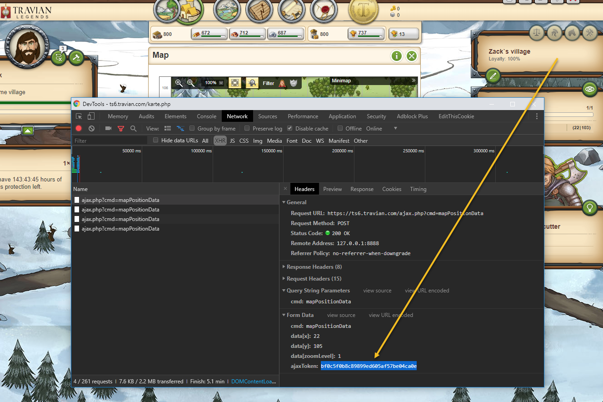

# Travian Animals Finder

 

The tool for analysis oases (free or occupied) and searching animals (Elephant and etc).

Tested in **Fire and Sand** and **Legends**.

 

## How to use

## Config

Set correct fields in `config.js` 

### ajaxToken

1. Open map, https://ts6.travian.com/karte.php

    

2. Open DevTools(F12 Chrome),  Network tab’s,  filter by XHR:

    
    
3. Select random request from list (F5 is it’s empty) and copy **ajaxtoken** from request:
    
    
    
### cookie

Copy your cookies from request(like ajaxToken):

### minMap, maxMap

Limit for searching (like part of the map or your coordinates).

### animal

Name of searching animal

### startX, startY

Position of search (your village or cap, probably), calculate distance (for sorting oases closest to you)

## Start

Run command `npm run clean` clean data directory and create files.
After that run `npm run collect` (collecting oases position) and wait… 
It will take a lot of time (depends on your config (minMap, maxMap, delayMin, delayMax) etc).

After execution `npm run collect` run  `npm run find`.

Result in excel file: `data/elephant_*.xlsx`

|  x  |  y  | Elephant | Another animal | hasCrocodile | hasTiger | totalAnimal |
| :---: | :---: | :--------: | :--------------: | :------------: | :--------: | :-----------: |
| -18 |  5  | 7 | 6 | 1 | 1 | 141 |
| -14 |  3  | 4 | 5 | 0 | 0 | 34 |
| -42 |  14 | 3 | 4 | 0 | 0 | 77 |
| -48 |  -7 | 3 | 4 | 0 | 0 | 84 |

## Technologies:

 - **JavaScript**;
 - **NodeJS**;
 - **Cheerio**.

## Author

*  [**Mykhavko Ivan**](https://github.com/Tegos)

## License

This project is licensed under the MIT License - see the [LICENSE](LICENSE) file for details